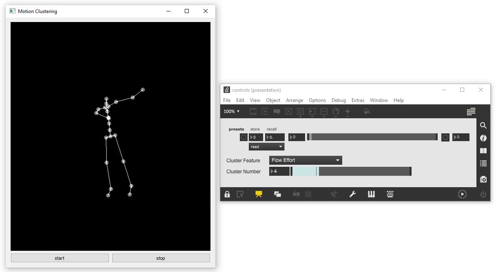

# AI-Toolbox - Motion Analysis - Clustering Interactive

### Summary

Clustering Interactive is a Python-based software for extracting motion segments from a motion capture recording and grouping the segments according to their similarity with regards to a chosen set of motion descriptors. While running, it sends skeleton joint data of the currently displayed motion segment in the form of local and global positions and local and global rotations via [OSC](https://en.wikipedia.org/wiki/Open_Sound_Control) to any destination address. Clustering Interactive can also be remote controlled via OSC.

### Description

Clustering Interactive reads a chosen motion capture recording and splits it into a number of motion segments whose duration and overlap can be specified by the user. The segments are subsequently analysed and the following descriptors are extracted: 3D joint positions, scalar joint distance to root joint, 3D joint velocity, scalar joint speed, 3D joint acceleration, scalar joint acceleration, 3D joint jerk, scalar joint jerk, quantity of motion, bounding box, bounding sphere, Laban Weight Effort, Laban Space Effort, Laban Time Effort, Laban Flow Effort. The user can chose any number of motion descriptors as basis for clustering as well as the number of clusters that should be created for each motion descriptor.  Clustering is based on the KMeans method This method is applied for each selected motion descriptor separately. Once clustering has been completed, the software plays the motion segments in a single cluster and displays them as an animation of a simple stick figure representation. The motion segments are played back in the sequence of their occurrence in the original motion capture recording and with a smooth interpolation between overlaps. Joint data of the currently played motion segments are sent via OSC to any other application. The software itself provides only a minimal GUI  for starting and stopping the skeleton animation playback. All other settings that can be changed while the software is running are controllable via OSC.

### Features

Reads motion capture recordings in BVH and (with limitations) in FBX format.
Provides algorithms to deduce several low and mid-level motion descriptors. 
Employs KMeans as clustering algorithm.
Provides real-time control for playback and cluster selection.
Sends joint position and rotation via OSC.
Provides an OSC-based protocol for remote control. 
Shows a simple stick figure representation of the currently played motion segments. 

### Limitations

The software only supports motion capture recordings that contain a single person.
It reads only motion capture recordings in FBX format in which each skeleton pose has its own keyframe and in which the number of keyframes is the same for all skeleton joints.
Most of the software controls are only accessible for OSC remote control and not via a GUI.
Only individual motion descriptors can be used for clustering but not combinations of descriptors.

### OSC Communication

The software sends the following OSC messages representing the joint positions and rotations of the currently displayed motion segment.
Each message contains all the joint properties grouped together as follows: j1_p1 j1_p2 ... j1_pD, j2_p1, j2_p2, ... j2_pD, ... , jN_p1, jN_p2, ... jN_pD- Here, j stands for joint, p for parameter, N for number of joints, and D for dimension of parameters.

The following OSC messages are sent by the software:

- joint positions as list of 3D vectors in world coordinates: `/mocap/0/joint/pos_world <float j1x> <float j1y> <float j1z> .... <float jNx> <float jNy> <float jNz>` 

- joint rotations as list of Quaternions in world coordinates: `/mocap/0/joint/rot_local <float j1w> <float j1x> <float j1y> <float j1z> .... <float jNw> <float jNx> <float jNy> <float jNz>` 

The following OSC messages are received by the software:

- select of motion descriptor for playback and OSC: `/synth/motionfeature <string feature_name>`
- select of cluster index for playback and OSC: `/synth/clusterlabel <int cluster_index>`
