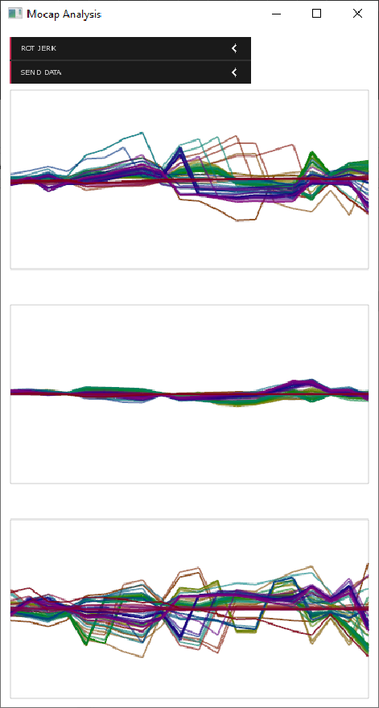

# AI-Toolbox - Motion Analysis - Motion Capture Analysis

## Summary

This C++-based tool provides a set of algorithms for analysing motion capture recordings in real-time. The following analysis functions are provided: positional and rotational derivatives (velocity, acceleration, and jerk) and Laban Effort Factors (Flow, Time,  Space, Weight). The software receives motion capture data via [OSC](https://en.wikipedia.org/wiki/Open_Sound_Control) and sends the analysis results also via [OSC](https://en.wikipedia.org/wiki/Open_Sound_Control). 

### Installation

For simply executing the software, no installation is required. The software runs on any MacOS or Windows 10 or 11 operating system. If the user wants to compile the software from source, both a C++ IDE such as [XCode](https://developer.apple.com/xcode/) on MacOS or [Visual Studio](https://visualstudio.microsoft.com/vs/community/) on Windows and the [openFrameworks](https://openframeworks.cc/) creative coding environment need to be installed beforehand. Installation instructions for Visual Studio and openFrameworks are available in the [AI Toolbox github repository](https://github.com/bisnad/AIToolbox). 

The software can be downloaded by cloning the [MotionUtilities Github repository](https://github.com/bisnad/MotionUtilities). After cloning, the software is located in the MotionUtilities / MocapAnalysis directory.

### Directory Structure

- MocapAnalysis (contains the XCode and Visual Studio project files)
  - bin (contains the software  executable and dynamic libraries)
    - data (contains a configuration file that specifies several software settings)
  - data 
    - media (contains media used in this Readme)
  - max (contains an example Max patch for forwarding OSC messages received by the MocapAnalysis tool to multiple IP addresses and ports)
  - src (contains the source code files)

## Usage
#### Start

The software can be started by double clicking the executable MocapAnalysis file. During startup, the software reads first one main configuration file entitled "config.json". This file defines the addresses and ports for sending and receiving OSC messages. The also specifies which additional configuration files to load. These additional files assign weights to joints ("joint_weights_xxx.json"), that group joints into different body parts ("joint_body_part_filters_xxx.json"), and that define the topology of the skeleton ("joint_connectivity_xxx.json"). In these files names, letters "xxx" refer to the specific motion capture system the configuration refers to. The files ending on "xsens.json" are meant to be used for motion capture data that is obtained with a [XSens system](https://www.movella.com/products/motion-capture) (full body capture without hands). The files ending on "qualisys.json" are meant to be used for motion capture data that is obtained with a [Qualisys system](https://www.qualisys.com/) (full body capture including hands). Following this principle, configuration files that support additional mocap systems can be easily created. 

#### Functionality

The software receives live motion capture via OSC messages. These messages contain 3D joint positions and joint orientations as quaternions. The software then passes this joint information through an analysis pipeline to extract low and mid level motion descriptors. The low level descriptors are computed for each joint individually and include: joint position in global coordinates, joint positions in local coordinates, linear joint velocities, linear joint accelerations, linear joint jerks, joint rotations in global coordinates, rotational joint velocities, rotational joint accelerations, rotational joint jerks. The mid level descriptors are computed for body parts (full body, torso and head, left arm, right arm, left leg, right leg) and include the four [Laban Effort Factors](https://en.wikipedia.org/wiki/Laban_movement_analysis): Weight Effort, Time Effort, Flow Effort, and Space Effort. These factors are derived separately from linear and rotational body part motions. While the software automatically computes these descriptors, the user can select which of these descriptors to display and time-varying graph and which of these descriptors to send as OSC messages.

#### Graphical User Interface

The user interface consists of two pull down menus and a graphing area. 

**Select Data for Plotting**

The first pull down menu allows to chose which of the incoming motion capture data or analysis results is displayed as time-varying graph in the graphing area. Only one type of data can be displayed at a time. One graph will be shown for each dimension of the data. Depending on the chosen motion descriptor, each graph corresponds to an individual joint or to a body part. 

**Select Data for OSC Sending**

The second pull down menu allows to chose which of the incoming motion capture data or analysis results is sent as OSC message to a client. Any number and combination of descriptors can be sent The items in this menu indicate the addresses of the corresponding OSC messages, with the exception that the menu displays them in upper case while the actual addresses are lowercase. 

## OSC Communication

The tool receives two types of OSC messages representing joint positions and joint rotations of a single skeleton, respectively. Each of these messages contains all the joint positions and rotations grouped together. In the OSC messages described below, N represents the number of joints.

- joint positions as list of 3D vectors in world coordinates: `/mocap/0/joint/pos_world <float j1x> <float j1y> <float j1z> .... <float jNx> <float jNy> <float jNz>` 
- joint positions as list of 3D vectors in world coordinates: `/mocap/0/joint/pos_world <float j1x> <float j1y> <float j1z> .... <float jNx> <float jNy> <float jNz>`

The tool sends OSC messages representing the the motion descriptors that have been selected by the user for sending. For each motion descriptor, all descriptor values are grouped together into a single OSC message. With the exception of motion descriptors based on Laban Effort Factors, each message contains all the joint properties grouped together. For the Laban Effort factors, each message contains the properties for the five different body parts. 

The following OSC messages can be chosen to be sent by the tool:

- joint positions as list of 3D vectors in world coordinates: `/mocap/0/joint/pos_world <float j1x> <float j1y> <float j1z> .... <float jNx> <float jNy> <float jNz>`
- joint positions as list of 3D vectors in local coordinates: `/mocap/0/joint/pos_local <float j1x> <float j1y> <float j1z> .... <float jNx> <float jNy> <float jNz>`
- joint linear velocities as list of 3D vectors: `/mocap/0/joint/velocity <float j1x> <float j1y> <float j1z> .... <float jNx> <float jNy> <float jNz>`
- joint linear accelerations as list of 3D vectors: `/mocap/0/joint/acceleration <float j1x> <float j1y> <float j1z> .... <float jNx> <float jNy> <float jNz>`
- joint linear jerks as list of 3D vectors: `/mocap/0/joint/jerk <float j1x> <float j1y> <float j1z> .... <float jNx> <float jNy> <float jNz>`

- joint rotations as list of Quaternions in world coordinates: `/mocap/0/joint/rot_world <float j1w> <float j1x> <float j1y> <float j1z> .... <float jNw> <float jNx> <float jNy> <float jNz>` 
- joint rotations as list of Euler values in world coordinates: `/mocap/0/joint/rot_euler <float j1x> <float j1y> <float j1z> .... <float jNx> <float jNy> <float jNz>` 
- joint rotations as list of Quaternions in local coordinates: `/mocap/0/joint/rot_local <float j1w> <float j1x> <float j1y> <float j1z> .... <float jNw> <float jNx> <float jNy> <float jNz>` 
- joint rotational velocities as list of Quaternions : `/mocap/0/joint/rot_velocity <float j1w> <float j1x> <float j1y> <float j1z> .... <float jNw> <float jNx> <float jNy> <float jNz>` 
- joint rotational accelerations as list of Quaternions : `/mocap/0/joint/rot_acceleration <float j1w> <float j1x> <float j1y> <float j1z> .... <float jNw> <float jNx> <float jNy> <float jNz>` 
- joint rotational jerks as list of Quaternions : `/mocap/0/joint/rot_jerk <float j1w> <float j1x> <float j1y> <float j1z> .... <float jNw> <float jNx> <float jNy> <float jNz>` 
- body part linear Weight Effort Factor as list of floats: `/mocap/0/bodypart/weight_effort <float 1> .... <float 6>` 
- body part linear Time Effort Factor as list of floats: `/mocap/0/bodypart/time_effort <float 1> .... <float 6>` 
- body part linear Flow Effort Factor as list of floats: `/mocap/0/bodypart/flow_effort <float 1> .... <float 6>` 
- body part linear Space Effort Factor as list of floats: `/mocap/0/bodypart/space_effort <float 1> .... <float 6>` 
- body part rotational Weight Effort Factor as list of floats: `/mocap/0/bodypart/rot_weight_effort <float 1> .... <float 6>` 
- body part rotational Time Effort Factor as list of floats: `/mocap/0/bodypart/rot_time_effort <float 1> .... <float 6>` 
- body part rotational Flow Effort Factor as list of floats: `/mocap/0/bodypart/rot_flow_effort <float 1> .... <float 6>` 
- body part rotational Space Effort Factor as list of floats: `/mocap/0/bodypart/rot_space_effort <float 1> .... <float 6>` 

### Limitations and Bugs

- The tool only supports motion capture recordings that contain a single person.