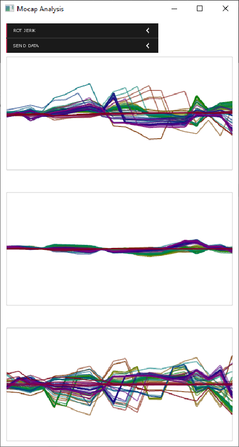

# Motion Capture Analysis

Daniel Bisig - Coventry University, UK - [ad5041@coventry.ac.uk](ad5041@coventry.ac.uk)

## Abstract

This software provides a set of analysis functions for motion capture recordings. The following analysis functions are provided: positional and rotational derivatives (velocity, acceleration, and jerk) and Laban Effort Factors (Flow, Time,  Space, Weight). The software receives motion capture data via OSC and sends the analysis results also via OSC. Accordingly, it acts as an in between link between a specific [Motion Capture Player](https://bitbucket.org/dbisig/mocapplayer/src/master/) software and any other client software receiving OSC data. 

## Usage

**Select Data for Plotting**

The first pull down menu allows to chose which of the incoming motion capture data or analysis results is displayed as time-varying graph. Only one type of data can be displayed at a time. One graph will be shown for each dimension of the data. Each graph displays the data for either all the individual skeleton joints (position, rotation, velocity, acceleration, jerk) or groups of skeleton joints (Flow, Time, Space, Weight). 

**Select Data for OSC Sending**

The second pull down menu allows to chose which of the incoming motion capture data or analysis results is sent as OSC message to a client. Any number and combination can be sent at the same time. The items in this menu indicate the addresses of the corresponding OSC messages, with the exception that the menu displays them in upper case while the actual addresses are lowercase. The IP-address and port to which these messages are sent are currently fixed to: 127.0.0.1:9004. The analysis software receives OSC data from the MocapPlayer on a fixed port which is 9003. The data and analysis results sent from the Analysis software are in interleaved format. For example the positions of all skeleton joints are sent as follows, with the number indicating the index of the joint: x0, y0, z0, x1, y1, z1, .... 

**Note on Laban Effort Factors**

Laban Effort Factors are calculated for five different groups of skeleton joints: 1. all joints 2. torso and head joints, left arm joints, right arm joints, left leg joints, right leg joints. These values are all sent together via OSC. 

**Compilation**

Currently, the player requires OpenFrameworks version 0.11.0 to compile. Furthermore, it has the following dependencies:

- [ofxDabBase](https://bitbucket.org/dbisig/ofxdabbase_011/src/master/ "Bitbucket")
- [ofxDabMath](https://bitbucket.org/dbisig/ofxdabmath_011/src/master/ "Bitbucket")
- [ofxDabOsc](https://bitbucket.org/dbisig/ofxdabosc_011/src/master/ "Bitbucket")
- [ofxDatGui](https://github.com/braitsch/ofxDatGui/ "Github")
- [ofxImGui](https://github.com/jvcleave/ofxImGui "Github")
- [ofxGrafica](https://github.com/jagracar/ofxGrafica "Github")
- [ofxJSON](https://github.com/jeffcrouse/ofxJSON "Github")

## Resources

- E2-Create [Project Page](https://wp.coventry.domains/e2create/ "Project Page")