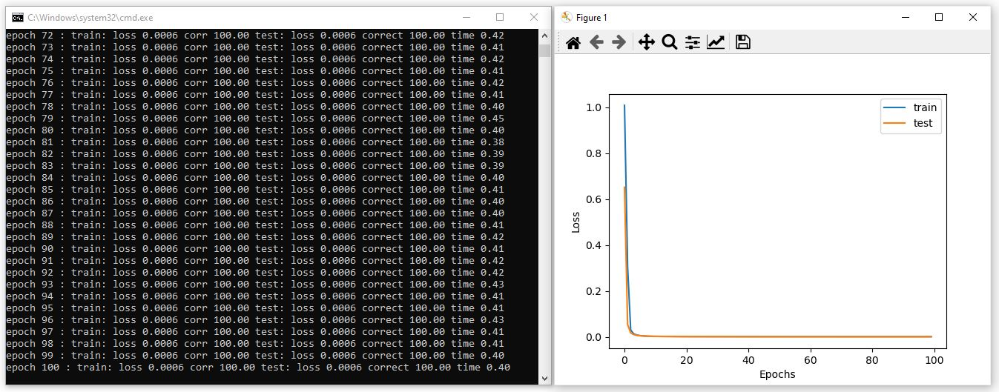

# AI-Toolbox - Motion Analysis - Mocap Classifier



Figure 1. Screenshot of the MocapClassifier after training concluded. The window on the left shows the console output of the learning progress. The window depicts the learning progress as graph plot. 

## Summary

This Python-based tool implements a simple machine learning model that can be trained to classify short motion capture sequences. This tool is used exclusively for training the machine learning model. There exists a second tool named [Mocap Classifier Interactive](https://github.com/bisnad/MotionAnalysis/tree/main/MocapClassifier_Interactive) for using the trained model.  This second tool runs in real-time and is suitable for live performance scenarios. 

### Installation

The tool runs within the *premiere* anaconda environment. For this reason, this environment has to be setup beforehand.  Instructions how to setup the *premiere* environment are available as part of the [installation documentation ](https://github.com/bisnad/AIToolbox/tree/main/Installers) in the [AI Toolbox github repository](https://github.com/bisnad/AIToolbox). 

The tool can be downloaded by cloning the [MotionAnalysis Github repository](https://github.com/bisnad/MotionAnalysis). After cloning, the tool is located in the MotionAnalysis / MocapClassifier directory.

### Directory Structure

MocapClassifier (contains tool specific python scripts)

- data
  - media (contains media used in this Readme)

- results
  - data (contains mean and standard deviation values to normalise motion capture sequences)
  - histories (contains logs of the training process both as csv file and graph plot)
  - weights (contains the weights of the trained model)


## Usage
#### Start

The tool can be started either by double clicking the mocap_classifier.bat (Windows) or mocap_classifier.sh (MacOS) shell scripts or by typing the following commands into the Anaconda terminal:

```
conda activate premiere
cd MocapAnalysisPython
python mocap_classifier.py
```

#### Functionality

The tool loads motion capture data in the form of recorded OSC messages that have been stored together with class labels in a python dictionary and exported to as a `.pkl` file . Such recordings can be created using the [MocapRecorder tool](https://github.com/bisnad/MotionUtilities/tree/main/MocapRecorder). 

To change the recording files that are used for training, the following source code has to be changed in the `mocap_classifier.py` file. 

```
data_file_path = "../../AIToolbox/Data/Mocap/Stocos/Solos/MovementQualities_IMU/"
data_sensor_ids = ["/accelerometer", "/gyroscope"]
```

The string assigned to the variable `data_file_path` contains the path to the directory that contains the recording files that should be loaded. Any file in this directory that has the suffix `.pkl` will be loaded. 
The list of strings that are assigned to the variable `data_sensor_ids` refer to the address part of the OSC messages that are extracted from the recordings. 

The tool reads the recorded OSC messages by concatenating their values into a timeseries of motion values. These values are subsequently normalised so that their mean value is zero and their standard deviation is 1. To create a dataset, the normalised timeseries is then split into short motion excerpts that possess a user specified length and that are offset from each other in the timeseries by a user specified value. To change the length and offset of the motion excerpts, the following source code has to be changed in the `mocap_classifier.py` file. 

```
data_window_length = 60
data_window_offset = 1
```

The integer value assigned to the variable `data_window_length`specifies the length of the motion excerpt. The integer value assigned to the variable `data_window_offset` specifies the offset between motion excerpts.

The model used for classifying the motion sequences consists of a simple [long short term memory](https://en.wikipedia.org/wiki/Long_short-term_memory) (LSTM) network. For this network, the tool employs by default 3 layers and 32 nodes. To change these settings, the following source code has to be changed in the `mocap_classifier.py` file. 

```
hidden_dim = 32
layer_count = 3
```

The integer value assigned to the variable `hidden_dim` specifies the number of LSMT units. This value should typically be higher than the dimension of the motion capture values. The integer value assigned to the variable `layer_count` specifies the number of LSTM layers. This value has to be estimated through trial and error and should be low enough to avoid overfitting but high enough to achieve a high classification accuracy. 

For training the model, the tool uses the following default settings: a train test split of the dataset of 80% and 20%, a batch_size of 32, an initial learning rate of 10^-3, a number of epochs of 100. Also, the training starts by default with randomly initialised model weights. To change these settings, the following source code has to be changed in the `mocap_classifier.py` file. 

```
test_percentage = 0.2
batch_size = 32
learning_rate = 1e-3
epochs = 100

load_weights = False
load_weights_epoch = 100
```

The float value assigned to the variable `test_percentage` represents the percentage of items in the dataset that are used for testing. In this example, a value of 0.2 corresponds to test set that contains 20% of the full dataset and a train set that contains 80% of the full dataset. The integer number assigned to the variable `batch_size` specifies the number of data items grouped into a batch. A high batch size is usually preferred to increase the stability of training. The float value assigned to the variable `learning_rate` specifies the learning rate employed at the beginning of training. The learning rate should be large enough to achieve quick training but small enough to avoid training instabilities. As training progresses, this learning rate halves every ten epochs. The integer assigned to the variable `epochs` specifies the number of epochs used for training. The bool value assigned to the variable `load_weights` specifies if the weights from a previous training run should be loaded. The integer assigned to the variable `load_weights_epoch` specifies the number of the epoch from which the weights from a previous training should be loaded. If `load_weights` is set to true, then the path and name of the weights file that will be loaded is: `results/weights/classifier_epoch_<integer>`with the `<integer>`  part replaced by the value of the `load_weights_epoch` variable. 

Once the dataset has been created and the model initialised, training begins and runs for the number of epochs specified by the user. During training, the tool prints for each epoch a log message to the console that provide information about the training progress. An example log message looks like this:

`epoch 1 : train: loss 1.0418 corr 63.72 test: loss 0.7590 correct 66.38 time 0.21`

The information specifies, from left to right: the epoch number, the loss on the train set, the loss on the test set, the percentage of correct classification on the test set, and the time elapsed.

At the end of training, the tool displays the training history as graph plot, and stores the training history both as image and `.csv` file, the last model weights, and the mean and standard deviation values used for normalisation. 

### Limitations and Bugs

- The model architecture is likely too basic for classifying long motion sequences. 