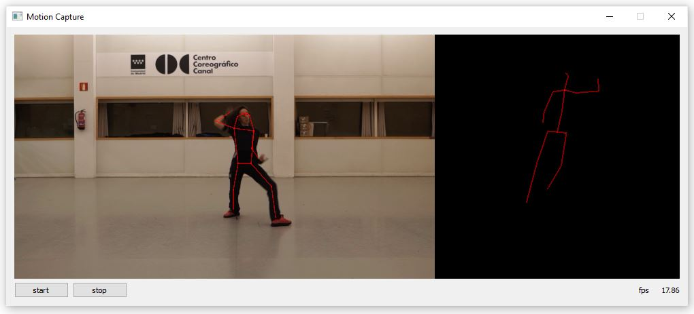
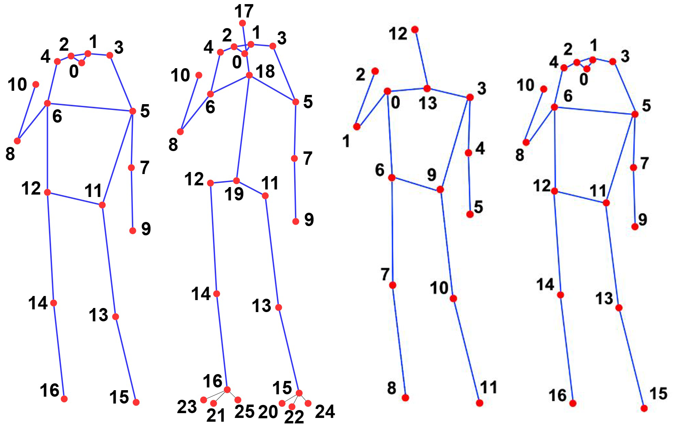
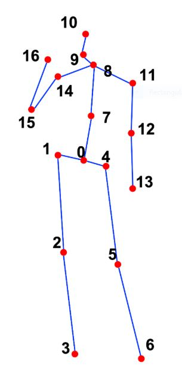

# AI-Toolbox - Motion Analysis - Pose Estimation - MMPose



Figure 1: Screenshot of the pose estimation tool that employs MMPose to detect both 2D and 2D keypoints. The 2D keypoints are shown superimposed on the input video image (left side). The 3D keypoints are shown in front of a black blackground (right side).

## Summary

This Python-based tool simplifies the use of the [MMPose pose estimation system](https://github.com/open-mmlab/mmpose) and adds functionality to send the positions of the detected keypoints as [OSC](https://en.wikipedia.org/wiki/Open_Sound_Control) messages. MMPose brings together a large variety of pose estimation models into a unified open-source toolbox. This includes models that  estimate keypoints of bodies, faces, hands, or animals and which output keypoint positions either in 2D or 3D coordinates. Most of these models operate in real-time or near-real-time. The models take monocular images as input that can either come from of folder of still images, a movie recording, or from a webcam. 

### Installation

The tool runs within the *openmmlab* anaconda environment. For this reason, this environment has to be setup beforehand.  Instructions how to setup the *openmmlab* environment are available as part of the [installation documentation ](https://github.com/bisnad/AIToolbox/tree/main/Installers) in the [AI Toolbox github repository](https://github.com/bisnad/AIToolbox). 

The tool can be downloaded by cloning the [MotionAnalysis Github repository](https://github.com/bisnad/MotionAnalysis). After cloning, the tool is located in the MotionAnalysis / PoseEstimation / MMPose directory.

### Directory Structure

MMPose

- data 
  - media (contains media used in this Readme)
- demo (contains tool specific python scripts for running the tool)
- docs (contains descriptions of commands for running the tools, an overview of pose estimation models the tool has been tested on, and some performance measurements of the tested models)
- mmpose (contains the python scripts from the MMPose project)

## Usage
#### Start

The tool can started in a variety of ways that differ from each other in the source of the input images (image folder, movie recordings, webcam) and the models used for 2D pose estimation and 3D post estimation. The following scripts are provided for starting the tool by double clicking the script file:

- mmpose_pose2d.bat : A Windows script for starting the tool in 2D pose estimation mode with the webcam as image source
- mmpose_pose2d.sh : A MacOS script for starting the tool in 2D pose estimation mode with the webcam as image source
- mmpose_pose3d.bat : A Windows script for starting the tool in 3D pose estimation mode with the webcam as image source
- mmpose_pose3d.sh : A MacOS script for starting the tool in 3D pose estimation mode with the webcam as image source

Alternatively, the tool can be started from the Anaconda terminal by running the demo/premiere_mmpose.py python script. To do this, the following commands have to be typed into the Anaconda terminal.

```
conda activate openmmlab
cd PoseEstimation/MMPose
python demo/premiere_mmpose.py <argument1> ---pose2D <argument2> ( --pose3D <argument3>)
```

The `<argument>` statements refers to a list of arguments that have to be passed to the mmpose python script to configure its mode of operation. 

The first argument specifies the source image(s) that the model used to detect keypoints. Possible options for argument1 are: 

- `webcam` : use a webcam as image source 
- `path to directory` : use a folder of still images as image source
- `path to a movie file` : use a movie recording as image source

The second argument specifies the model to be used for 2D pose estimation. MMPose offers a wide variety of models for 2D pose estimation. These models employ different body representations for 2D keypoint detection. The following images show a selection of body representations for 2D keypoint detections. This selection corresponds to the models that have been tested by the author of this repository. 



Figure 2: Skeleton conventions for 2D pose estimation. From left to right, the conventions are: COCO, Halpe26, AIC, HumanArt. The images have been taken from https://mmpose.readthedocs.io/en/latest/dataset_zoo/2d_body_keypoint.html

Currently, only models that work with the COCO convention for 2D keypoint detection are also suitable for 3D pose estimation.  The 2D pose estimation models that have been tested by the author of this repository and that can be combined with 3D pose estimation are the following ones:

- ipr_res50_8xb64-210e_coco-256x256
- ipr_res50_dsnt-8xb64-210e_coco-256x256
- rtmpose-l_8xb256-420e_aic-coco-256x192
- rtmpose-l_8xb256-420e_aic-coco-384x288
- rtmpose-l_8xb256-420e_coco-256x192
- rtmpose-m_8xb256-420e_aic-coco-256x192
- rtmpose-m_8xb256-420e_aic-coco-384x288
- rtmpose-m_8xb256-420e_coco-256x192
- rtmpose-s_8xb256-420e_aic-coco-256x192
- simcc_res50_8xb32-140e_coco-384x288
- simcc_res50_8xb64-210e_coco-256x192
- simcc_vipnas-mbv3_8xb64-210e_coco-256x192

The models that have been tested by the author of this repository and that cannot be combined with 3D pose estimation are the following ones:

- rtmpose-l_8xb512-700e_body8-halpe26-256x192
- rtmpose-l_8xb512-700e_body8-halpe26-384x28
- rtmpose-l_8xb256-420e_body8-384x288
- rtmpose-m_8xb256-420e_body8-384x288
- rtmpose-m_8xb512-700e_body8-halpe26-256x192
- rtmpose-m_8xb512-700e_body8-halpe26-384x288
- rtmpose-l_8xb256-420e_humanart-256x192
- td-hm_res101_8xb64-210e_aic-256x192

The third argument specifies the model to be used for 3D pose estimation. MMpose also offers a variety of models for 3D pose estimation. These models require as input not an image but the 2D keypoint positions that are output by a 2D pose estimation model. So far, the author has tested 3D pose estimation models that employ the Human3.6M skeleton convention.



Figure 3: The Human3.6M skeleton convention. The image is taken from: https://mmpose.readthedocs.io/en/latest/dataset_zoo/3d_body_keypoint.html

The 3D pose estimation models that have been tested by the author of this repository are the following ones:

- image-pose-lift_tcn_8xb64-200e_h36m
- motionbert_dstformer-243frm_8xb32-240e_h36m
- motionbert_dstformer-ft-243frm_8xb32-120e_h36m
- video-pose-lift_tcn-1frm-supv-cpn-ft_8xb128-160e_h36m
- video-pose-lift_tcn-27frm-supv_8xb128-160e_h36m
- video-pose-lift_tcn-81frm-supv_8xb128-160e_h36m
- video-pose-lift_tcn-243frm-supv_8xb128-160e_h36m
- video-pose-lift_tcn-243frm-supv-cpn-ft_8xb128-200e_h36m

Shown here are some examples for running the premiere_mmpose.py python script with different arguments from the Anaconda terminal.

```
python demo/premiere_mmpose.py ../../../../Data/Video/Stocos/Solos/Take4_Blumen_Baile.mp4 --pose2d rtmpose-l_8xb256-420e_humanart-256x192
```

Runs the tool with a 2D pose estimation model that employs the HumanArt skeleton convention on a movie recording

```
python demo/premiere_mmpose.py ../../../../Data/Video/Stocos/Solos/Take4_Blumen_Baile.mp4 --pose2d ipr_res50_8xb64-210e_coco-256x256 --pose3d image-pose-lift_tcn_8xb64-200e_h36m
```

Runs the tool with a 2D pose estimation model that employs the COCO skeleton convention and a 3D pose estimation model that employs the Human3.6M skeleton convention on a movie recording

```
python demo/premiere_mmpose.py webcam --pose2d td-hm_res101_8xb64-210e_aic-256x192
```

Runs the tool with a 2D pose estimation model that employs the AIC skeleton convention on images that are live captured with a webcam.

```
python demo/premiere_mmpose.py webcam --pose2d ipr_res50_8xb64-210e_coco-256x256 --pose3d image-pose-lift_tcn_8xb64-200e_h36m
```

Runs the tool with a 2D pose estimation model that employs the COCO skeleton convention and a 3D pose estimation models that employs the Human3.6M skeleton convention on images that are live captured with a webcam.

#### Functionality

The tool reads as input monocular images that can stem either from a folder of still images or a movie recording or are live captured by a webcam. The tool then employs the chosen model(s) to conduct 2D and optionally also 3D keypoint detection on the input images. The keypoints are both displayed visually and sent as OSC messages.

#### Graphical User Interface

The user interface consists of the following elements from top left to right bottom. A panel that shows 2D keypoints and lines connecting them superimposed on the input image. A panel that is either empty (if not 3D pose estimation is conducted) or shows 3D keypoints and lines connecting them in front of a black background. If multiple skeletons are being tracked, these skeletons are depicted at a fixed offset next to each other (this offset is not representative of the actual distance between the tracked performers). A button to start pose estimation and a button to stop it. A string indicating the current frames per second with which the tool is processing the input images.

## OSC Communication

The tool sends OSC messages representing the 2D or 3D positions of the keypoints that have been detected. For each performer that is tracked, a single OSC message is sent. If the tool is performing solely 2D pose estimation, then the OSC message that represents the keypoints contains a list of 2D vectors in normalised image coordinates. In addition, a second OSC message is sent that contains a list of floats (one float for each keypoint) representing the visibility of the keypoints in the input image. If the tool is performing both 2D and 3D pose estimation, then the OSC that represents the keypoints contains a list of 3D vectors in word coodinates. In addition, a second OSC message is sent that contains a list of floats (one float for each keypoint) that represents the fidelity of each keypoint.

The following OSC messages are sent by the tool. In these messages, `<Skeleton Index>` is an integer value the represents the skeleton whose keypoints are being sent, and N represents the number of keypoints.

- keypoint positions as list of 2D vectors in normalised image coordinates: `/mocap/<Skeleton Index>/joint/pos_world <float k1x> .... <float kNx> <float kNy>`
- keypoint positions as list of 3D vectors in world coordinates: `/mocap/<Skeleton Index>/joint/pos_world <float k1x> <float k1y> <float k1z> .... <float kNx> <float kNy> <float kNz>`
- keypoint visibilities as list of float values: `/mocap/0/joint/visibility <float k1> .... <float kN>`
- keypoint fidelity scores as list of float values: `/mocap/0/joint/scores <float k1> .... <float kN>`

By default, the tool sends OSC messages to the same computer it is running on and to port 9007. To change the address and / or port,  the following source code in the file mocap_analysis.py has to be modified:

```
motion_sender.config["ip"] = "127.0.0.1"
motion_sender.config["port"] = 9007
```

The string value assigned to the dictionary key `motion_sender.config["ip"]` represents the IP address to which the OSC messages are sent. The string "128.0.0.1" represents the local computer. 
The integer value assigned to the dictionary key `motion_sender.config["port"]` represents the port to OSC messages are sent.

### Limitations and Bugs

- When multiple skeletons are detected, the tool does guarantee continuity in their tracking.
- Some of the 2D pose estimation models available struggle with detecting keypoints for unusal poses (poses on the ground, overextended poses, legs higher than arms, etc)
- All 3D pose estimation models available produce very jittery keypoints. 