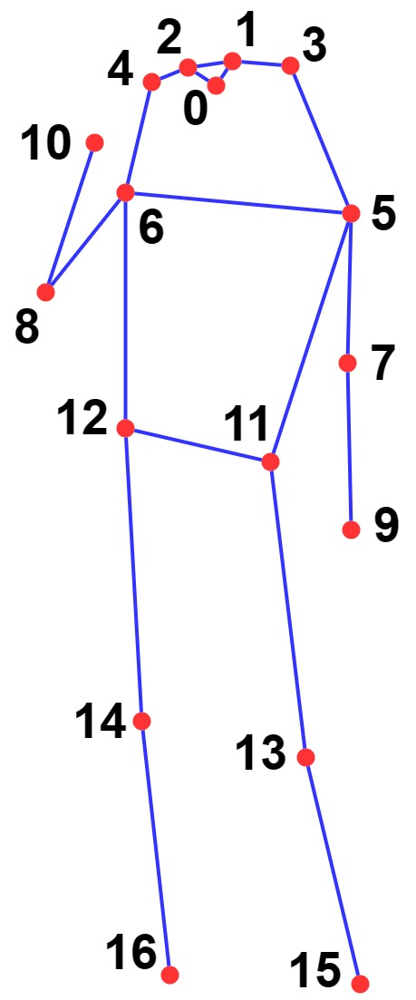

# AI-Toolbox - Motion Analysis - Pose Estimation - Yolo


Figure 1: Screenshot of the pose estimation tool that employs the Yolo system to detect 2D. The 2D keypoints, bounding box, and classifier label are shown superimposed on the input video image.

## Summary

This Python-based tool simplifies the use of the pose estimation functionality provided by [Yolo V8.0](https://github.com/ultralytics/ultralytics) and adds functionality to send the positions of the detected keypoints as [OSC](https://en.wikipedia.org/wiki/Open_Sound_Control) messages. Yolo offers several models to detect 2D keypoints of bodies. The models take monocular images as input that can either come from a still image, a movie recording, or from a webcam. 

### Installation

The tool runs within the *ultralytics* anaconda environment. For this reason, this environment has to be setup beforehand.  Instructions how to setup the *ultralytics* environment are available as part of the [installation documentation ](https://github.com/bisnad/AIToolbox/tree/main/Installers) in the [AI Toolbox github repository](https://github.com/bisnad/AIToolbox). 

The tool can be downloaded by cloning the [MotionAnalysis Github repository](https://github.com/bisnad/MotionAnalysis). After cloning, the tool is located in the MotionAnalysis / PoseEstimation / Yolo directory.

### Directory Structure

Yolo

- data 
  - media (contains media used in this Readme)
- docs (contains a description of the skeleton representation used by Yolo)
- models (contains pre-trained 2D pose estimation models )

## Usage
#### Start

The tool can started in a variety of ways that differ from each other in the source of the input images (still image, movie recordings, webcam) and the models used for 2D pose estimation. The following scripts are provided for starting the tool by double clicking the script file:

- yolo_pose2d.bat : A Windows script for starting the tool in 2D pose estimation mode with the webcam as image source
- yolo_pose2d.sh : A MacOS script for starting the tool in 2D pose estimation mode with the webcam as image source

Alternatively, the tool can be started from the Anaconda terminal by running the yolo_pose2d.py python script. To do this, the following commands have to be typed into the Anaconda terminal.

```
conda activate ultralytics
cd PoseEstimation/Yolo
python yolo_pose2d.py <argument1> ---pose2D <argument2>
```

The `<argument>` statements refers to a list of arguments that have to be passed to the yolo_pose2d python script to configure its mode of operation. 

 `<argument1>` specifies the source image(s) that the model used to detect keypoints. Possible options for argument1 are: 

- `webcam` : use a webcam as image source 
- `path to a still image or movie recording` : use a still image or movie recording as image source

`<argument2>`specifies the model to be used for 2D pose estimation. Yolo offers a variety of models for 2D pose estimation that differ from each other with regards to inference speed and detection accuracy. These models employ different body representations for 2D keypoint detection. These models employ the COCO body representations for 2D keypoint detections (see Figure 2). This selection corresponds to the models that have been tested by the author of this repository. 



Figure 2: COCO Skeleton conventions for 2D pose estimation. The image have been taken from https://mmpose.readthedocs.io/en/latest/dataset_zoo/2d_body_keypoint.html

The following models are available for version 8.0 of Yolo (from top to bottom, the models increase in inference speed and decrease in accuracy ).

- yolov8x-pose.pt
- yolov8l-pose.pt
- yolov8m-pose.pt
- yolov8s-pose.pt
- yolov8n-pose.pt

Shown here are some examples for running the yolo_pose2d.py python script with different arguments from the Anaconda terminal.

```
python yolo_pose2d.py ../../../../Data/Video/Stocos/Solos/Take4_Blumen_Baile.mp4 --pose2d yolov8m-pose.pt
```

Runs the tool with the yolov8m-pose 2D pose estimation model on a movie recording

```
python yolo_pose2d.py webcam --pose2d yolov8s-pose.pt
```

Runs the tool with the yolov8s-pose 2D pose estimation model on images that are live captured with a webcam.

#### Functionality

The tool reads as input monocular image(s) that can stem either from a still images, a movie recording, or are live captured by a webcam. The tool then employs the chosen model(s) to conduct 2D keypoint detection on the input image(s). The keypoints are both displayed visually and sent as OSC messages.

#### Graphical User Interface

The user interface consists of a panel that shows 2D keypoints and lines connecting them as well as a bounding box with class label superimposed on the input image. 

## OSC Communication

The tool sends OSC messages representing the 2D positions of the keypoints that have been detected. For each performer that is tracked, a single OSC message is sent. The OSC message represents contains a list of 2D vectors in normalised image coordinates. In this message, `<Skeleton Index>` is an integer value the represents the skeleton whose keypoints are being sent, and N represents the number of keypoints.

- keypoint positions as list of 2D vectors in normalised image coordinates: `/mocap/<Skeleton Index>/joint/pos_world <float k1x> .... <float kNx> <float kNy>`

By default, the tool sends OSC messages to the same computer it is running on and to port 9007. To change the address and / or port,  the following source code in the file mocap_analysis.py has to be modified:

```
motion_sender.config["ip"] = "127.0.0.1"
motion_sender.config["port"] = 9007
```

The string value assigned to the dictionary key `motion_sender.config["ip"]` represents the IP address to which the OSC messages are sent. The string "128.0.0.1" represents the local computer. 
The integer value assigned to the dictionary key `motion_sender.config["port"]` represents the port to OSC messages are sent.

### Limitations and Bugs

- When multiple skeletons are detected, the tool does guarantee continuity in their tracking.
- The tool can only be stopped by typing Control-C into the Anaconda terminal.