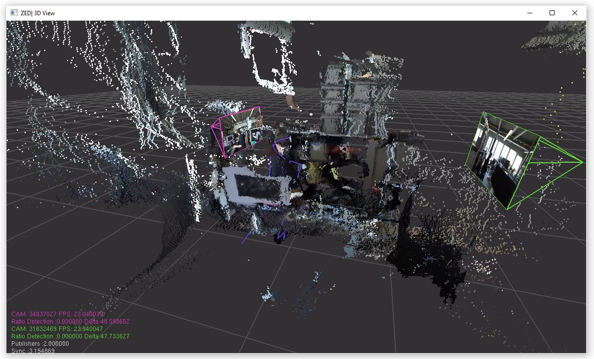

# AI-Toolbox - Motion Analysis - Pose Estimation - ZED_C++ - Body Tracking Multi Camera OSC



Figure 1: Screenshot of the C++-based pose estimation tool that employs the body tracking functionality of the ZED SDK to detect both 2D and 3D keypoints in a stereoimage captured simultaneously by several ZED Camera. 

## Summary

This C++-based tool employs the body tracking functionality of the [ZED SDK](https://www.stereolabs.com/docs) to detect both 2D and 3D keypoints. The tool also sends the positions of the detected keypoints as [OSC](https://en.wikipedia.org/wiki/Open_Sound_Control) messages. The tool operates in real-time and takes as input live streams from several [ZED cameras](https://www.stereolabs.com/en-ch/products/zed-2). Since the ZED SDK supports only Windows and Linux operating systems, no MacOS version of the tool is provided. 

### Installation

To simply run the tool, no installation is required. The software runs on any Windows 10 or 11 operating system. If the user wants to compile the software from source, both a C++ IDE such as [Visual Studio](https://visualstudio.microsoft.com/vs/community/) and the ZED SDK need to be installed beforehand. Installation instructions for Visual Studio and the ZED SDK are available in the [AI Toolbox github repository](https://github.com/bisnad/AIToolbox). 

The tool can be downloaded by cloning the [MotionAnalysis Github repository](https://github.com/bisnad/MotionAnalysis). After cloning, the tool is located in the `MotionAnalysis/PoseEstimation/ZED_C++/body_tracking_multi-camera_osc` directory.

### Directory Structure

body_tracking_osc

- cpp
  - build (project files for Visual Studio and)
    - Release (target directory for compiled executables)

  - include (C++ source code header files)
  - libs (oscpack library)
  - src (C++ source code cpp files)

- data
  - calib (calibration file for multi camera setup)
  - media (contains media used in this Readme)
  
- docs (documentation concerning the mapping between joint indices from live capture to FBX format)

## Usage
#### Start

The tool is provided in two precompiled versions, one for employing the Body34 representation when running the ZED tracking algorithm and the other for employing the Body38 representation. Either of these tools can be started by double clicking the corresponding executable. This will cause the tool to read a default calibration configuration file, run with the corresponding body representation for tracking performers in several live captured stereoscopic image streams, and send OSC messages  to a default IP address (127.0.0.1) and port (9007). Alternatively, the tool can be started from the Windows command prompt. Doing so offers the possibility to pass some arguments to select a different calibration configuration file and to configure the IP address and port to which the tool sends OSC messages to. The following combinations of arguments are possible:

```
body34_tracking_multi-camera_osc.exe (or body38_tracking_multi-camera_osc.exe) 
```

This starts the tool in the same mode as when double clicking its executable.

```
body34_tracking_multi-camera_osc.exe (or body38_tracking_multi-camera_osc.exe) <argument1>
```

Here, `argument1` specifies the path to a calibration file for multi camera setup. OSC messages are sent by the tool to a default IP address and Port.

```
body34_tracking_multi-camera_osc.exe (or body38_tracking_multi-camera_osc.exe) <argument1> <argument2>  <argument3>
```

Here, `argument1` specifies the path to a calibration file for multi camera setup. `Argument2` and `argument3` specify the IP address and port to which the tool sends OSC addresses to.  

#### Functionality

The tool reads as input stereoscopic images that are live captured from multiple ZED cameras. Compared to a single camera setup, a multi-camera setup offers higher tracking accuracy and reduces the likelihood of keypoints becoming occluded. For the tool to work, the ZED cameras need all be connected via USB to the same computer. Stereolabs also offers the possibility to access cameras that are connected to multiple computers via Ethernet. This feature is currently not supported by the tool. The tool employs the ZED SDK body tracking algorithm to extract keypoints from the incoming stereoscopic image. The tool supports either Stereolab's Body34 or Body38 skeleton representation (see Figure 2). 


Figure 2: Stereolabs' Body Representations that are supported by the tool. The left image depicts the Body34 representation and the right image depicts the Body38 representation. The joint indices shown in these figures are not the ones sent by the tool (see text). The images have been taken from: https://www.stereolabs.com/docs/body-tracking

For some reason, the joint indices in the body representations are different when captured live and when exported in FBX format (see [fbx_export tool](https://github.com/bisnad/MotionAnalysis/tree/main/PoseEstimation/ZED_C%2B%2B/fbx_export)). To enforce compatibility between these representations, the tool changes the joint indices from live capture to match those of the FBX format. The remapping is documented in  `docs/Body34_JointMapping.txt` and `docs/Body38_JointMapping.txt`. 

While the tool is running, body representations of the tracked performers are sent via OSC messages (see OSC Communication). The tool can be stopped by closing the window that depicts the 3D keypoints. 

#### Graphical User Interface

The user interface consists of a single window that shows the 3D keypoints of the tracked performers, the camera positions and their captured images, and a combined point cloud.

## OSC Communication

The tool sends OSC messages representing the positions and rotations of the keypoints and root positions. There are a total of six different OSC messages that are sent for each performer that is being tracked. The following OSC messages are sent by the tool. In these messages, `<Skeleton Index>` is an integer value the represents the skeleton whose keypoints are being sent, and N represents the number of keypoints.

- keypoint positions as list of 3D vectors in world coordinates: `/mocap/<Skeleton Index>/joint/pos2d_world <float k1x> <float k1y> .... <float kNx> <float kNy>`
- keypoint positions as list of 3D vectors in normalised image coordinates: `/mocap/<Skeleton Index>/joint/pos_world <float k1x> <float k1y> <float k1z> .... <float kNx> <float kNy> <float kNz>`
- keypoint positions as list of 3D vectors in relative coordinates: `/mocap/<Skeleton Index>/joint/pos_local <float k1x> <float k1y> <float k1z> .... <float kNx> <float kNy> <float kNz>`
- keypoint rotations as list of quaternions vectors in local coordinates: `/mocap/<Skeleton Index>/joint/rot_local <float k1w> <float k1x> <float k1y> <float k1z> .... <float kNw> <float kNx> <float kNy> <float kNz>`
- root position as 3D vector in world coordinates: `/mocap/<Skeleton Index>/joint/root_pos_world <float k1x> <float k1y> <float k1z>`
- root rotation as quaternion in world coordinates: `/mocap/<Skeleton Index>/joint/root_rot_world <float k1w> <float k1x> <float k1y> <float k1z>`

### Limitations and Bugs

- The body tracking functionality of the ZED SDK doesn't track hand and finger orientations.