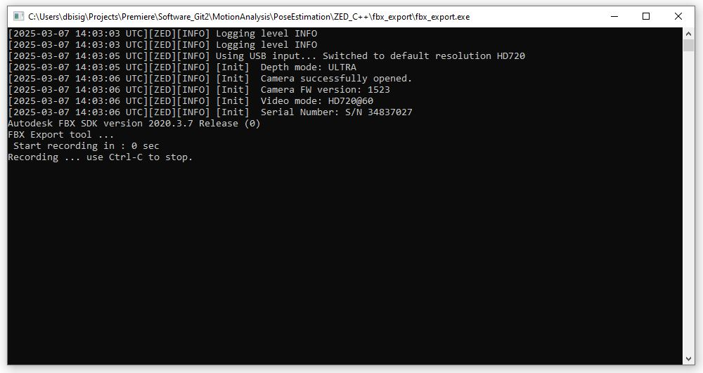

# AI-Toolbox - Motion Analysis - Pose Estimation - ZED_C++ - FBX Export



Figure 1: Screenshot of the C++-based tool that exports body tracking data either from a ZED Camera live stream or recording as FBX file. 

## Summary

This C++-based tool exports body tracking data that has been obtained either from a ZED Camera live stream or recording as FBX file.  Since the ZED SDK supports only Windows and Linux operating systems, no MacOS version of the tool is provided. 

### Installation

To simply run the tool, no installation is required. The software runs on any Windows 10 or 11 operating system. If the user wants to compile the software from source, both a C++ IDE such as [Visual Studio](https://visualstudio.microsoft.com/vs/community/) and the ZED and FBX SDKs need to be installed beforehand. Installation instructions for Visual Studio and the ZED SDK are available in the [AI Toolbox github repository](https://github.com/bisnad/AIToolbox). 

The tool can be downloaded by cloning the [MotionAnalysis Github repository](https://github.com/bisnad/MotionAnalysis). After cloning, the tool is located in the `MotionAnalysis/PoseEstimation/ZED_C++/fbx_export` directory.

### Directory Structure

fbx_export

- cpp
  - build (project files for Visual Studio)
    - Release (target directory for compiled executables)
  - include (C++ source code header files)
  - src (C++ source code cpp files)
- data
  - media (contains media used in this Readme)
- docs (documentation concerning the Body34 and Body38 skeletons in FBX format)

## Usage
#### Start

The tool is provided in two precompiled versions, one for employing the Body34 representation when exporting motion capture data in FBX  format and the other for employing the Body38 representation. Either of these tools can be started by double clicking the corresponding executable.  This will cause the tool to run with the corresponding body representation being used for tracking performers in a live stereoscopic image stream from a connect ZED camera. Alternatively, the tool can be started from the Windows command prompt.  Doing so offers the possibility to pass as argument the path to a ZED camera recording in SVO format.

```
body34_fbx_export.exe (or body38_fbx_export.exe) <argument>
```

Here, `argument` specifies  specifies the path to a ZED camera recording in SVO that serves as source for stereoscopic images used for body tracking. 

If the tool is used in combination with a live ZED camera input, it employs a 3 seconds countdown before the recording of body tracking data begins. 

#### Functionality

The tool reads as input stereoscopic images that can stem either from a ZED camera recording in SVO format or from a live capture with a ZED camera. The tool employs the ZED SDK body tracking algorithm to extract keypoints from the incoming stereoscopic image. The tool supports either Stereolab's Body34 or Body38 skeleton representation (see Figure 2). 


Figure 2: Stereolabs' Body Representations that are supported by the tool. The left image depicts the Body34 representation and the right image depicts the Body38 representation. The joint indices shown in these figures are not identical with the ones in the stored FBX file. The images have been taken from: https://www.stereolabs.com/docs/body-tracking

For some reason, the joint indices in the body representations are different when captured live and when exported in FBX format. The skeleton topology and joint indices used for the FBX export are described in the files `docs/ZED_Body34_skeleton.txt` and `docs/ZED_Body38_skeleton.txt` for ZED's Body34 and Body38 representations, respectively. While the tool is running, motion data of the tracked performers is collected. When the tool is running with live camera input, the key-combination CTRL-C has to be entered in the Windows command prompt to end data collection. If the tool is running with a camera recording, data collection stops automatically when the full recording has been read. After stopping, the tool exports the collected motion data as FBX file. This file is named `ZedSkeletons.fbx` and is located in the same folder as the tool's executables. 

### Limitations and Bugs

- The body tracking functionality of the ZED SDK doesn't track hand and finger orientations.
- Exporting motion data after tracking multiple performers simultaneously is untested.