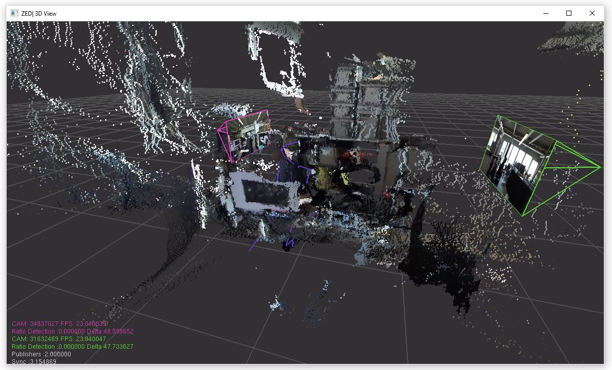
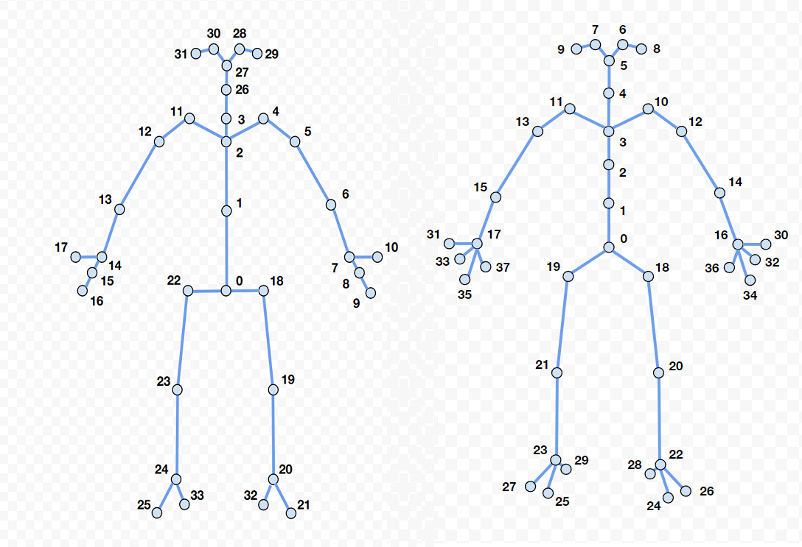

# AI-Toolbox - Motion Analysis - Pose Estimation - ZED_C++ - FBX Export Multi Camera



Figure 1: Screenshot of the C++-based tool that exports body tracking data obtained from several ZED camera live streams. 

## Summary

This C++-based tool exports body tracking data that has been obtained from several ZED camera live streams. Since the ZED SDK supports only Windows and Linux operating systems, no MacOS version of the tool is provided. 

### Installation

To simply run the tool, no installation is required. The software runs on any Windows 10 or 11 operating system. If the user wants to compile the software from source, both a C++ IDE such as [Visual Studio](https://visualstudio.microsoft.com/vs/community/) and the ZED and FBX SDKs need to be installed beforehand. Installation instructions for Visual Studio and the ZED SDK are available in the [AI Toolbox github repository](https://github.com/bisnad/AIToolbox). 

The tool can be downloaded by cloning the [MotionAnalysis Github repository](https://github.com/bisnad/MotionAnalysis). After cloning, the tool is located in the `MotionAnalysis/PoseEstimation/ZED_C++/fbx_export_multi-camera` directory.

### Directory Structure

fbx_export_multi-camera

- cpp
  - build (project files for Visual Studio)
    - Release (target directory for compiled executables)
  - include (C++ source code header files)
  - src (C++ source code cpp files)
- data
  - calib (calibration file for multi camera setup)
  - media (contains media used in this Readme)
- docs (documentation concerning the Body34 and Body38 skeletons in FBX format)

## Usage
#### Start

The tool is provided in two precompiled versions, one for employing the Body34 representation when exporting motion capture data in FBX  format and the other for employing the Body38 representation. Either of these tools can be started by double clicking the corresponding executable. This will cause the tool to read a default calibration configuration file and run with the corresponding body representation for tracking performers in the live stereoscopic image streams from multiple connect ZED cameras. Alternatively, the tool can be started from the Windows command prompt.  Doing so offers the possibility to pass as argument the path to a different calibration configuration file

```
body34_fbx_export_multi-camera.exe (or body38_fbx_export_multi-camera.exe)
```

This starts the tool in the same mode as when double clicking its executable.

```
xxxxxxxxxx body34_fbx_export_multi-camera.exe (or body38_fbx_export_multi-camera.exe) <argument>
```

Here, `argument specifies the path to a calibration file for multi camera setup. 

#### Functionality

The tool reads as input stereoscopic images that are live captured from multiple ZED cameras. Compared to a single camera setup, a multi-camera setup offers higher tracking accuracy and reduces the likelihood of keypoints becoming occluded. For the tool to work, the ZED cameras need all be connected via USB to the same computer. Stereolabs also offers the possibility to access cameras that are connected to multiple computers via Ethernet. This feature is currently not supported by the tool. The tool employs the ZED SDK body tracking algorithm to extract keypoints from the incoming stereoscopic image. The tool supports either Stereolab's Body34 or Body38 skeleton representation (see Figure 2). 



Figure 2: Stereolabs' Body Representations that are supported by the tool. The left image depicts the Body34 representation and the right image depicts the Body38 representation. The joint indices shown in these figures are not the ones sent by the tool (see text). The images have been taken from: https://www.stereolabs.com/docs/body-tracking

For some reason, the joint indices in the body representations are different when captured live and when exported in FBX format. The skeleton topology and joint indices used for the FBX export are described in the files `docs/ZED_Body34_skeleton.txt` and `docs/ZED_Body38_skeleton.txt` for ZED's Body34 and Body38 representations, respectively. While the tool is running, motion data of the tracked performers is collected.  When closing the tool's window, it exports the collected motion data as FBX file before shutting down. This file is named `ZedSkeletons.fbx` and is located in the same folder as the tool's executables. 

#### Graphical User Interface

The user interface consists of a single window that shows the 3D keypoints of the tracked performers, the camera positions and their captured images, and a combined point cloud.

### Limitations and Bugs

- The body tracking functionality of the ZED SDK doesn't track hand and finger orientations.
- Exporting motion data after tracking multiple performers simultaneously is untested.