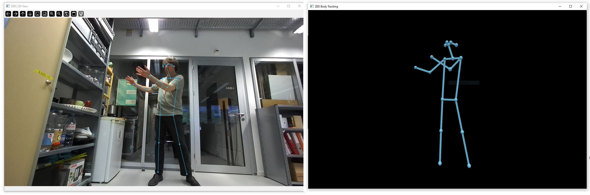
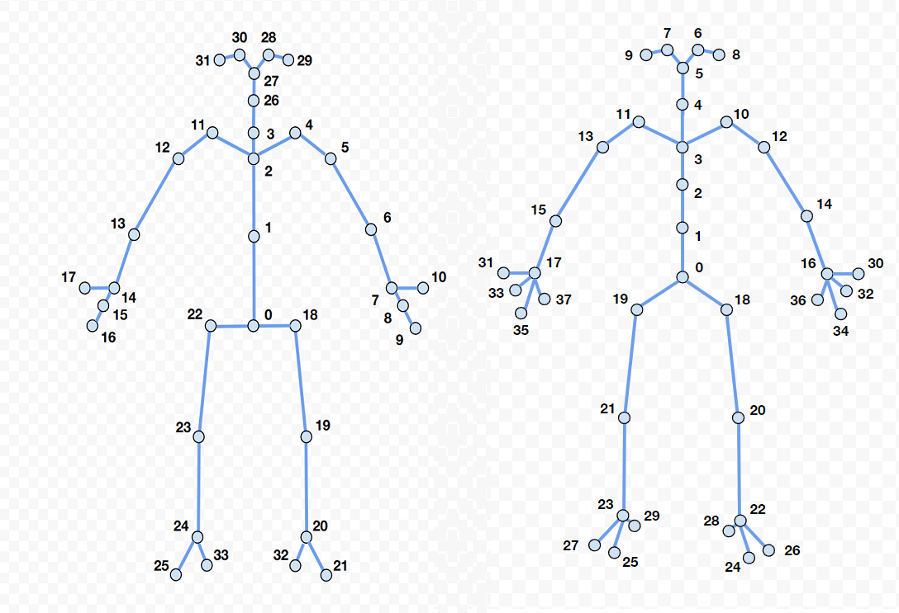

# AI-Toolbox - Motion Analysis - Pose Estimation - ZED_Python - Body Tracking OSC



Figure 1: Screenshot of the Python-based pose estimation tool that employs the body tracking functionality of the ZED SDK to detect both 2D and 3D keypoints in a stereoimage captured by a ZED Camera. The 2D keypoints are shown superimposed on the input video image (left side). The 3D keypoints are shown in front of a black blackground (right side).

## Summary

This Python-based tool employs the body tracking functionality of the [ZED SDK](https://www.stereolabs.com/docs) to detect both 2D and 3D keypoints. To this, tool adds functionality to send the positions of the detected keypoints as [OSC](https://en.wikipedia.org/wiki/Open_Sound_Control) messages. The tool operates in real-time and takes as input either a live stream from a [ZED camera](https://www.stereolabs.com/en-ch/products/zed-2) or a recording stored in the Stereolab's custom [SVO format](https://www.stereolabs.com/docs/video/recording). Since the ZED SDK supports only Windows and Linux operating systems, no MacOS version of the tool is provided. 

### Installation

The tool runs within the *zed* anaconda environment. For this reason, this environment has to be setup beforehand.  Instructions how to setup the *openmmlab* environment are available as part of the [installation documentation ](https://github.com/bisnad/AIToolbox/tree/main/Installers) in the [AI Toolbox github repository](https://github.com/bisnad/AIToolbox). 

The tool can be downloaded by cloning the [MotionAnalysis Github repository](https://github.com/bisnad/MotionAnalysis). After cloning, the tool is located in the MotionAnalysis / PoseEstimation / ZED_Python / body_tracking_osc directory.

### Directory Structure

body_tracking_osc

- cv_viewer (python code to render the camera image and tracked skeleton(s) in 2D)
- ogl_viewer (python code to render the tracked skeleton in 3D)
- data
  - media (contains media used in this Readme)
- docs (documentation concerning the mapping between joint indices from live capture to FBX format)

## Usage
#### Start

The software can be started either by double clicking the body_tracking_osc.bat (Windows) shell script or by typing the following commands into the Anaconda terminal:

```
conda activate zed
cd PoseEstimation/ZED_Python/body_tracking_osc
python demo/body_tracking_osc.py (--input_svo_file <argument1>)
```

The `--input_svo_file <argument1>` statement is optional. If it is provided, then `<argument1>`  specifies the path to a ZED camera recording in SVO that serves as source for stereoscopic images used for body tracking . If the statement is omitted, stereo-images are live captured by a ZED camera that must be connected to the computer. 

#### Functionality

The tool reads as input stereoscopic images that can stem either from a ZED camera recording in SVO format or from a live capture with a ZED camera. The tool employs the ZED SDK body tracking algorithm to extract keypoints from the incoming stereoscopic image. The tool supports either Stereolab's Body34 or Body38 skeleton representation (see Figure 2). 



Figure 2: Stereolabs' Body Representations that are supported by the tool. The left image depicts the Body34 representation and the right image depicts the Body38 representation. The joint indices shown in these figures are not the ones sent by the tool (see text). The images have been taken from: https://www.stereolabs.com/docs/body-tracking

For some reason, the joint indices in the body representations are different when captured live and when exported in FBX format (see [fbx_export tool](https://github.com/bisnad/MotionAnalysis/tree/main/PoseEstimation/ZED_C%2B%2B/fbx_export)). To enforce compatibility between these representations, the tool changes the joint indices from live capture to match those of the FBX format. The remapping is documented in  `docs/Body34_JointMapping.txt` and `docs/Body38_JointMapping.txt`. 

By default, the tool employs the Body34 representation. To use the Body38 representation, the following source code in the file `body_tracking_osc.py` needs to be changed. 

```
# joint map for boddy 34 to match joint numbers from live capture with those in an fbx recording
joint_map = [ 0, 1, 2, 11, 12, 13, 14, 15, 16, 17, 3, 26, 27, 28, 29, 30, 31, 4, 5, 6, 7, 8, 9, 10, 18, 19, 20, 21, 32, 22, 23, 24, 25, 33 ]
# joint map for body 38 to match joint numbers from live capture with those in an fbx recording
# joint_map = [ 0, 1, 2, 3, 4, 5, 6, 8, 7, 9, 10, 12, 14, 16, 30, 32, 34, 36, 11, 13, 15, 17, 31, 33, 35, 37, 18, 20, 22, 24, 26, 28, 19, 21, 23, 25, 27, 29 ]
```

While the tool is running, body representations of the tracked performers are sent via OSC messages (see OSC Communication). The tool can be stopped by closing the window that depicts the 3D keypoints. 

#### Graphical User Interface

The user interface consists of two separate windows. One window shows the 2D keypoints of the tracked performers superimposed on a monocular image. The second window shows the 3D keypoints of the tracked performers in front of a black blackground (right side).

## OSC Communication

The tool sends OSC messages representing the positions and rotations of the keypoints and root positions. There are a total of six different OSC messages that are sent for each performer that is being tracked. The following OSC messages are sent by the tool. In these messages, `<Skeleton Index>` is an integer value the represents the skeleton whose keypoints are being sent, and N represents the number of keypoints.

- keypoint positions as list of 3D vectors in world coordinates: `/mocap/<Skeleton Index>/joint/pos2d_world <float k1x> <float k1y> .... <float kNx> <float kNy>`
- keypoint positions as list of 3D vectors in normalised image coordinates: `/mocap/<Skeleton Index>/joint/pos_world <float k1x> <float k1y> <float k1z> .... <float kNx> <float kNy> <float kNz>`
- keypoint positions as list of 3D vectors in relative coordinates: `/mocap/<Skeleton Index>/joint/pos_local <float k1x> <float k1y> <float k1z> .... <float kNx> <float kNy> <float kNz>`
- keypoint rotations as list of quaternions vectors in local coordinates: `/mocap/<Skeleton Index>/joint/rot_local <float k1w> <float k1x> <float k1y> <float k1z> .... <float kNw> <float kNx> <float kNy> <float kNz>`
- root position as 3D vector in world coordinates: `/mocap/<Skeleton Index>/joint/root_pos_world <float k1x> <float k1y> <float k1z>`
- root rotation as quaternion in world coordinates: `/mocap/<Skeleton Index>/joint/root_rot_world <float k1w> <float k1x> <float k1y> <float k1z>`

By default, the tool sends OSC messages to the same computer it is running on and to port 9007. To change the address and / or port,  the following source code in the file `body_tracking_osc.py` has to be modified:

```
motion_sender.config["ip"] = "127.0.0.1"
motion_sender.config["port"] = 9007
```

The string value assigned to the dictionary key `motion_sender.config["ip"]` represents the IP address to which the OSC messages are sent. The string "127.0.0.1" represents the local computer. 
The integer value assigned to the dictionary key `motion_sender.config["port"]` represents the port to OSC messages are sent.

### Limitations and Bugs

- The body tracking functionality of the ZED SDK doesn't track hand and finger orientations.