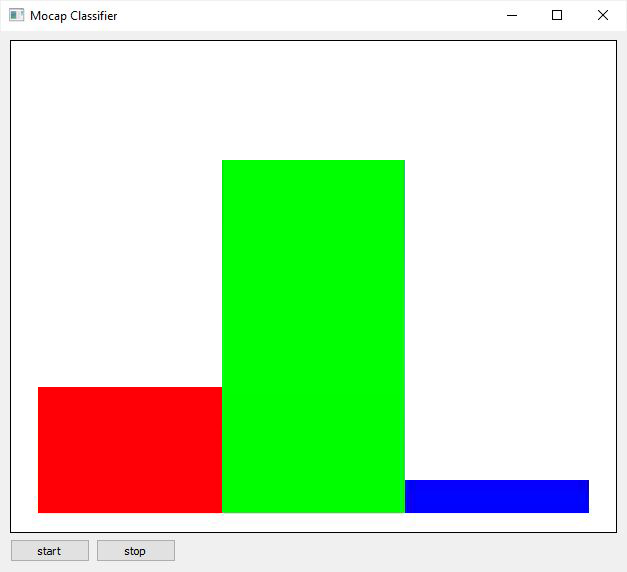

# AI-Toolbox - Motion Analysis - Sensor Classifier Interactive



Figure 1. Screenshot of the Sensor Classifier Interactive. The color bars in the graph represent the result of a classification that is conducted in real-time on incoming motion capture data. Each class is represented by a different color and the height of the bar is proportional to the class probability.

## Summary

This Python-based tool implements a simple machine learning model that has been trained to classify short motion capture sequences. This tool is meant to be used in live performance scenarios. It uses an already trained model and runs it in real-time to classify motion capture data that is incoming as [OSC](https://en.wikipedia.org/wiki/Open_Sound_Control) messages. The classification results are then sent by the tool as [OSC](https://en.wikipedia.org/wiki/Open_Sound_Control) messages to any other application. There exists a second tool named [Sensor Classifier](https://github.com/bisnad/MotionAnalysis/tree/main/SensorClassifier) that can be used for training models. This second tool is used for training only and does not run in real-time. 

### Installation

The tool runs within the *premiere* anaconda environment. For this reason, this environment has to be setup beforehand.  Instructions how to setup the *premiere* environment are available as part of the [installation documentation ](https://github.com/bisnad/AIToolbox/tree/main/Installers) in the [AI Toolbox github repository](https://github.com/bisnad/AIToolbox). 

The tool can be downloaded by cloning the [MotionAnalysis Github repository](https://github.com/bisnad/MotionAnalysis). After cloning, the tool is located in the MotionAnalysis / SensorClassifier_Interactive directory. 

### Directory Structure

SensorClassifier_Interactive (contains tool specific python scripts)

- data
  - media (contains media used in this Readme)
  - results
    - data (mean and standard deviation to normalise motion data)
    - weights (weights of a previously trained model)


## Usage
#### Start

The tool can be started either by double clicking the `sensor_classifier.bat` (Windows) or `sensor_classifier.sh` (MacOS) shell scripts or by typing the following commands into the Anaconda terminal:

```
conda activate premiere
cd SensorClassifier_Interactive
python sensor_classifier.py
```

During startup, the tool loads both the model weights from a previous training run and the mean and standard deviation values that were calculated prior to training to normalise the motion capture data from the local data/results folder. This training run used as motion capture data recordings of sensor data (acceleration and gyroscope) from a mobile phone. The model was trained on this data to recognise three different movement qualities. To load a different training run, the following source code has to be modified in the file `sensor_classifier.py.` 

```
data_norm_path = "data/results/data/"
data_sensor_ids = ["/accelerometer", "/gyroscope"]
data_sensor_dims = [3, 3]
data_window_length = 60

...

hidden_dim = 32
layer_count = 3
class_count = 3
model_weights_file = "data/results/weights/classifier_weights_epoch_100.pth"
```

The string assigned to the variable `data_norm_path` represents the parent path that contains the exported mean and standard deviations used for normalising the motion data.  The list of strings that are assigned to the variable `data_sensor_ids` refers to the address part of the OSC messages that are extracted from the recordings.  The list of integers that are assigned to the variable `data_sensor_dims` refers to the number of values contained in each OSC messages (which corresponds to the dimension of the sensor values stored in the OSC messages). The integer value assigned to the variable `data_window_length`specifies the length of the motion excerpt. This value must be identical with the one used when training the classifier. The integer value assigned to the variable `hidden_dim` specifies the number of LSMT units. This value must be identical with the one used when training the classifier. The integer value assigned to the variable `layer_count` specifies the number of LSTM layers. This value must be identical with the one used when training the classifier. The integer value assigned to the variable `class_count` specifies the number of classes the model was trained to recognise. This value must be identical with the one used when training the classifier.
The string value assigned to the variable `model_weights_file` specifies the file from which the weights from a previous training should be loaded.

#### Functionality

The tool receives short motion excerpts in the form of OSC messages that are generated when live capturing a performer. The tool used the previously trained classifier model to estimate the probability that the motion excerpts belong to any of the classes that the model is supposed to distinguish. These class probabilities are then sent as OSC messages. 

### Graphical User Interface

The tool provides a minimal GUI  for starting and stopping the classifier and for displaying the class probabilities are bar graph (see Figure 1). 

### OSC Communication

The tool receives motion data as OSC messages, with one message for each type of motion data. The address part of these OSC messages must correspond to the list of string values assigned to the variable `data_sensor_ids`. The arguments part of the OSC messages consists of a number of float values. This number corresponds to the list of integer values assigned to the variable `data_sensor_dims`. In this example, the following two types of OSC messages are received by the tool:

- acceleration sensor data : ` /accelerometer <float j> <float 2> <float 3>` 
- gyroscope sensor data : `/gyroscope<float j> <float 2> <float 3>` 

By default, the tool receives its OSC messages from any IP address and on port 9000. To change this port, the following source code in the file clustering_interactive.py has to be modified:

    osc_receive_ip = "0.0.0.0"
    osc_receive_port = 9000

The string value assigned to the variable `osc_receive_ip` represents the IP address from which the OSC messages are received from. The string "0.0.0.0" represents any IP address.
The integer value assigned to the variable `osc_receive_port` represents the port in which the tool receives the OSC messages.

The tool sends the class probabilities predicated by the classifier as OSC messages. The address part of this messages is /motion/class and the arguments are float values. The number of float values corresponds to the number of classes that the classifier distinguishes. The format of these messages is as follows:

- class probabilities : `/motion/class <float 1> .... <float N>` 

By default, the tool sends its OSC messages to IP address 127.0.0.1 and port 10000. To change the address and/or port, the following source code in the file clustering_interactive.py has to be modified:

    osc_send_ip = "127.0.0.1"
    osc_send_port = 10000

The string value assigned to the variable `osc_send_ip` represents the IP address to which the tool sends OSC messages. The string "127.0.0.1" represents the same computer the tool is running on.
The integer value assigned to the variable `osc_send_port` represents the port in which the tool sends OSC messages.

### Limitations and Bugs

- The model architecture is likely too basic for classifying long motion sequences. 